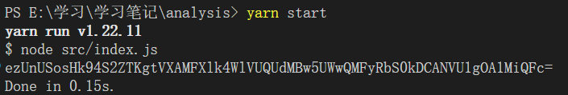

# 项目运行

```
yarn start
```
# 分析过程
## debug
参照文章[爬虫JS逆向之-七麦数据](https://blog.csdn.net/m0_63533079/article/details/130541180)的步骤进入下面的网站，打开控制台，选择榜单类型*全部*

点击网络可以看到，页面的发出了下面的请求，其中`analysis`参数是请求加密后的参数
![\[图片\]](/images/2.png)
响应结果
![\[图片\]](/images/3.png)
## 加密参数获取
加密部分主要是参数的`analysis`，下面说明`analysis`参数值的结果是怎么加密得到的：
1. `function(t){...}`函数对请求做处理，最终要拿到加密后的`e`(即`analysis`)
![\[图片\]](/images/4.png)
我把上面的请求配置函数`f(t){...}`复制下来方便解释

```javascript
function beforeRequest(t) {
  try {
    var n;
    f ||
      F != s ||
      ((n = (0, i[Wt])(m)),
      (s = c[x][k][Pt] = -(0, i[Wt])(l) || +new z[W]() - a2 * n));
    var e,
      r = +new z[W]() - (s || H) - 1661224081041,
      a = [];
    return (
      void 0 === t[Zt] && (t[Zt] = {}),
      z[Z][i7](t[Zt])[M](function (n) {
        if (n == p) return !B;
        t[Zt][N2](n) && a[b](t[Zt][n]);
      }),
      (a = a[Ot]()[I1](_)), 
      (a = (0, i[jt])(a)), 
      (a = (a += v + t[Jt][T](t[Mt], _)) + (v + r) + (v + 3)), 
      (e = (0, i[jt])((0, i[qt])(a, d))),
      -B == t[Jt][j](p) &&
        (t[Jt] += (-B != t[Jt][j](Rn) ? Hn : Rn) + p + B1 + z[V1](e)),
      t
    );
  } catch (t) {}
}
```

2. 可以看到：`e = (0, i[jt])((0, i[qt])(a, d))`，这里的参数0可以忽略，[文章](https://blog.csdn.net/m0_63533079/article/details/130541180)中说0表示代码执行的优先级，因此`e=i[jt](i[qt](a, d))`，这里的`i[jt]`指加密函数`v(t)`，`i[qt]`指解密函数`h(n,t)`
```javascript
// 加密函数 i[jt]
function v(t) {
  t = z[V1](t)[T](/%([0-9A-F]{2})/g, function (n, t) {
    return o(Y1 + t);
  });
  try {
    return z[Q1](t);
  } catch (n) {
    return z[W1][K1](t)[U1](Z1);
  }
}
// 解密函数 i[qt]
function h(n, t) {
  t = t || u();
  for (var e = (n = n[$1](_))[R], r = t[R], a = q1, i = H; i < e; i++)
    n[i] = o(n[i][a](H) ^ t[(i + 10) % r][a](H));
  return n[I1](_);
}
```
3. 因此`e`的值也可写作：`e=v(h(a,d))`，下面分析参数`a`和`d`的在走到第25行计算`e`结果时是如何计算得到的。
## 计算参数
  1. 从debug模式右侧的作用域里可以看到请求参数t：
![\[图片\]](/images/5.png)
2. 这里再改一下请求配置函数`beforeRequest`，仅截取对计算analysis值有作用的代码，返回`e`加上了注释。`a`的计算主要是下面6个步骤
```javascript
function beforeRequest(t) {
  // t: 请求配置config，请求参数：t.params
  try {
    var e,
      r = +new z[W]() - (s || H) - 1661224081041,
      //1. 赋值为空数组
      a = [];
    void 0 === t[Zt] && (t[Zt] = {});
      // 下面是一个forEach回调，遍历每个请求参数 t[Zt] = t.params ={brand: "all",country: "cn",device: "iphone",genre: "36"}
      z[Z][i7](t[Zt])[M](function (n) {
        if (n == p) return !B; // p='analysis', B=1
        // 2. 这个函数执行没找到，应该把参数映射成结果数组，即从t.params得到下面步骤3的a
        t[Zt][N2](n) && a[b](t[Zt][n]); 
      }),
      //3. a = ["all","cn","iphone","36"]
      a = a[Ot]()[I1](_); //数组sort后用空字符串join
      //4. a="36allcniphone"
      a = (0, i[jt])(a); //加密a，i[jt]即上面的函数v
      //5. a="MzZhbGxjbmlwaG9uZQ=="
      a = (a += v + t[Jt][T](t[Mt], _)) + (v + r) + (v + 3); //t[Jt]=t.url='/rank/indexPlus/brand_id/2', r=23597922830(时间戳ms) v="@#"
      //6. a="MzZhbGxjbmlwaG9uZQ==@#/rank/indexPlus/brand_id/2@#23597922830@#3"
      e = (0, i[jt])((0, i[qt])(a, d)); // d = "xyz517cda96abcd"
      return e;
    );
  } catch (t) {}
}
```
 3. 函数中用到了闭包65165中的变量`d, p, s`，代码往上翻可以看到这几个变量的定义：

3. 复制下来简单变形后得到：
```javascript
  d = i[zt](Rt, B);
  s = c[x][k][Pt]; //c为Vue实例，这个变量为Vue.prototype.difftime，根据组件有所不同，这里直接赋值为610
  p = (i[Bt](i[Ht](Gt), d),i[Bt](i[Ht](It), d),i[Bt](i[Ht](Dt), d),i[Bt](i[Ht]($t), d));
```
可以看到代码里包含了很多常量，如`Zt, W, jt`等，可以在debug时的作用域闭包中找到

 
 
4. 替换掉里面的常量，找到这些函数的定义(下面为了避免函数与变量重名，将替换后的函数名后均添加了f，如函数v名字为vf)，

5. 得到如下代码：

```javascript
function beforeRequest(t) {
  var d = "xyz517cda96abcd"; //d = i[zt](Rt, B) = yf("qimai@2022&Technology", 1) = "xyz517cda96abcd",
  s = 610;                  // s = c[x][k][Pt] = Vue.prototype.difftime，根据组件有所不同，这里测试的页面为610
  p = "analysis";           // p = (i[Bt](i[Ht](Gt), d),i[Bt](i[Ht](It), d),i[Bt](i[Ht](Dt), d),i[Bt](i[Ht]($t), d)) 
                            //   = (pf(lf("Jwo="),d),pf(lf("Jw0=", d),pf(lf("Jw8=", d),pf(lf(""GRcbWUhEChc="", d)) 
                            //   = "analysis"
  var v = "@#";             // v = i[Bt](i[Ht](Nt), d) = pf(lf("OFo="), d) = "@#"
  try {
    let e,
      r = +new Date() - (s || 0) - 1661224081041,
      a = [];
    void 0 === t.params && (t.params = {});
    Object.keys(t.params).forEach(function (n) {
      if (n == p) return !B;
      t.params.hasOwnProperty(n) && a.push(t.params[n]);
    });
    a = a.sort().join("");
    a = vf(a);
    a = (a += v + t.url.replace(t.baseURL, "")) + (v + r) + (v + 3);
    e = vf(hf(a, d));
    return e;
  } catch (t) {}
}
```
6. 其中被替换的函数如下：
```javascript
// 加密 i[jt]
function vf(t) {
  t = encodeURIComponent(t).replace(/%([0-9A-F]{2})/g, function (n, t) {
    return ofn("0x" + t);
  });
  try {
    return btoa(t);
  } catch (n) {
    return Buffer.from(t).toString("base64");
  }
}
// 解密 i[qt]
function hf(n, t) {
  // t = t || u();
  for (
    let e = (n = n.split("")).length, r = t.length, a = "charCodeAt", i = 0;
    i < e;
    i++
  ) {
    n[i] = ofn(n[i][a](0) ^ t[(i + 10) % r][a](0));
  }
  return n.join("");
}

function ofn(n) {
  (t = ""),
    [
      "66",
      "72",
      "6f",
      "6d",
      "43",
      "68",
      "61",
      "72",
      "43",
      "6f",
      "64",
      "65",
    ].forEach(function (n) {
      t += unescape("%u00" + n);
    });
  var t,
    e = t;
  return String[e](n);
}

/************************* 下面是计算d, p需要的函数 ********************/
// i[zt]
function yf(n, t, e) {
  for (var r = void 0 === e ? 2166136261 : e, a = 0, i = n.length; a < i; a++)
    r =
      (r ^= n.charCodeAt(a)) +
      ((r << 1) + (r << 4) + (r << 7) + (r << 8) + (r << 24));
  return t ? ("xyz" + (r >>> 0).toString(16) + "abcd").substr(-16) : r >>> 0;
}

// i[Bt]
function pf(n, t) {
  // t = t || u();
  for (
    let e = (n = n.split("")).length, r = t.length, a = "charCodeAt", i = 0;
    i < e;
    i++
  )
    n[i] = String.fromCharCode(n[i][a](0) ^ t[i % r][a](0));
  return n.join("");
}
// i[Ht]
function lf(n) {
  return decodeURIComponent(
    (function (t) {
      try {
        return atob(t);
      } catch (n) {
        return z["Buffer"]["from"](t, "base64").toString();
      }
    })(n)
      .split("")
      .map(function (n) {
        return "%" + ("00" + n.charCodeAt(0).toString(16)).slice(-2);
      })
      .join("")
  );
}
```
## 完整代码
参考： src/index.js
七麦网站源码参考：src/qimaiSourceCode.js
分析过程代码：test.js

运行结果：
